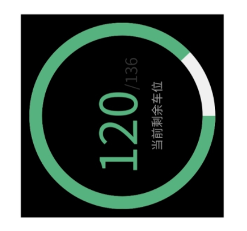
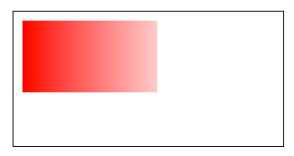

在小程序开发过程中经常涉及到一些图表类需求，其中环形进度条比较属于比较常见的需求


`[中间的文字部分需要自己实现，因为每个项目不同，本工具只实现进度条]`

上图中，一方面我们我们需要实现动态计算弧度的进度条，还需要在进度条上加上渐变效果，如果每次都需要自己手写，那需要很多重复劳动，所以决定为为小程序生态圈贡献一份小小的力量，下面来介绍一下整个工具的实现思路，喜欢的给个star咯

https://github.com/lucaszhu2zgf/mp-progress

环形进度条由灰色底圈+渐变不确定圆弧+双色纽扣组成，首先先把页面结构写好：

```
.canvas{
    position: absolute;
    top: 0;
    left: 0;
    width: 400rpx;
    height: 400rpx;
}
```

因为进度条需要盖在文字上面，所以采用了绝对定位。接下来先把灰色底圈给画上：

```
const context = wx.createContext();
// 打底灰色曲线
context.beginPath();
context.arc(this.convert_length(200), this.convert_length(200), r, 0, 2*Math.PI);
context.setLineWidth(12);
context.setStrokeStyle('#f0f0f0');
context.stroke();


wx.drawCanvas({
    canvasId: 'progress',
    actions: context.getActions()
});
```
效果如下：


接下来就要画绿色的进度条，渐变暂时先不考虑
```
// 圆弧角度
const deg = ((remain/total).toFixed(2))*2*Math.PI;     
// 画渐变曲线
context.beginPath();
// 由于外层大小是400，所以圆弧圆心坐标是200,200
context.arc(this.convert_length(200), this.convert_length(200), r, 0, deg);
context.setLineWidth(12);
context.setStrokeStyle('#56B37F');
context.stroke();


// 辅助函数，用于转换小程序中的rpx
convert_length(length) {
    return Math.round(wx.getSystemInfoSync().windowWidth * length / 750);
}
```


似乎完成了一大部分，先自测看看不是满圆的情况是啥样子，比如现在剩余车位是120个


因为圆弧函数arc默认的起点在3点钟方向，而设计想要的圆弧的起点从12点钟方向开始，现在这样是没法达到预期效果。是不是可以使用css让canvas自己旋转-90deg就好了呢？于是我在上面的canvas样式中新增以下规则：
```
.canvas{
    transform: rotate(-90deg);
}
```
但是在真机上并不起作用，于是我把新增的样式放到包裹canvas的外层元素上，发现外层元素已经旋转，可是圆弧还是从3点钟方向开始的，唯一能解释这个现象的是官方说：小程序中的canvas使用的是原生组件，所以这样设置css并不能达到我们想要的效果



所以必须要在canvas画图的时候把坐标原点移动到弧形圆心，并且在画布内旋转-90deg


```
// 更换原点
context.translate(this.convert_length(200), this.convert_length(200));
// arc原点默认为3点钟方向，需要调整到12点
context.rotate(-90 * Math.PI / 180);
// 需要注意的是，原点变换之后圆弧arc原点也变成了0,0
```
真机预览效果达成预期


接下来添加环形渐变效果，但是canvas原本提供的渐变类型只有两种：

1、LinearGradient线性渐变



2、CircularGradient圆形渐变


两种渐变中离设计效果最近的是线性渐变，至于为什么能够形成似乎是随圆形弧度增加而颜色变深的效果也只是控制坐标开始和结束的坐标位置罢了
```
const grd = context.createLinearGradient(0, 0, 100, 90);
grd.addColorStop(0, '#56B37F');
grd.addColorStop(1, '#c0e674');


// 画渐变曲线
context.beginPath();
context.arc(0, 0, r, 0, deg);
context.setLineWidth(12);
context.setStrokeStyle(grd);
context.stroke();
```
来看一下真机预览效果：


非常棒，最后就剩下跟随进度条的纽扣效果了


根据三角函数，已知三角形夹角根据公式radian = 2*Math.PI/360*deg，再利用cos和sin函数可以x、y，从而计算出纽扣在各部分半圆的坐标
```
const mathDeg = ((remain/total).toFixed(2))*360;
// 计算弧度
let radian = '';
// 圆圈半径
const r = +this.convert_length(170);
// 三角函数cos=y/r，sin=x/r，分别得到小点的x、y坐标
let x = 0;
let y = 0;
if (mathDeg <= 90) {
  // 求弧度
  radian = 2*Math.PI/360*mathDeg;
  x = Math.round(Math.cos(radian)*r);
  y = Math.round(Math.sin(radian)*r);
} else if (mathDeg > 90 && mathDeg <= 180) {
  // 求弧度
  radian = 2*Math.PI/360*(180 - mathDeg);
  x = -Math.round(Math.cos(radian)*r);
  y = Math.round(Math.sin(radian)*r);
} else if (mathDeg > 180 && mathDeg <= 270) {
  // 求弧度
  radian = 2*Math.PI/360*(mathDeg - 180);
  x = -Math.round(Math.cos(radian)*r);
  y = -Math.round(Math.sin(radian)*r);
} else{
  // 求弧度
  radian = 2*Math.PI/360*(360 - mathDeg);
  x = Math.round(Math.cos(radian)*r);
  y = -Math.round(Math.sin(radian)*r);
}
```


有了纽扣的圆形坐标，最后一步就是按照设计绘制样式了

```
// 画纽扣
context.beginPath();
context.arc(x, y, this.convert_length(24), 0, 2 * Math.PI);
context.setFillStyle('#ffffff');
context.setShadow(0, 0, this.convert_length(10), 'rgba(86,179,127,0.5)');
context.fill();


// 画绿点
context.beginPath();
context.arc(x, y, this.convert_length(12), 0, 2 * Math.PI);
context.setFillStyle('#56B37F');
context.fill();
```
来看一下最终效果


欢迎大家使用